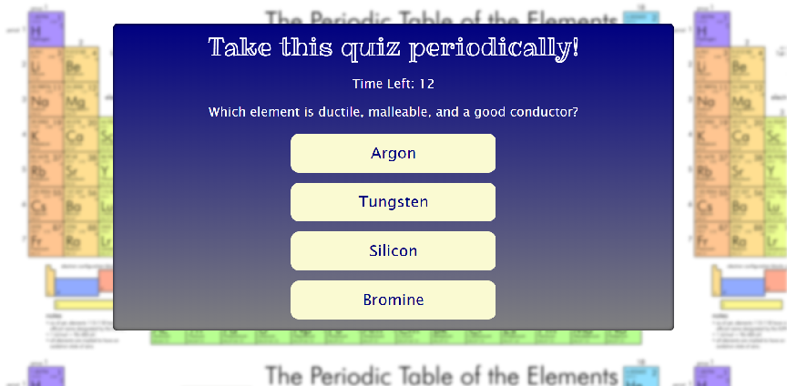

# TriviaGame
This Periodic Table Trivia Game is a timed game that tests your knowledge of the periodic table. With 5 basic chemistry questions, it will keep track of how well you paid attention in high school chemistry!

## Developer's Toolkit:
html, CSS, JavaScript, jquery

## Live Link: 
https://jivinjules.github.io/TriviaGame/

## Website Screenshot:

